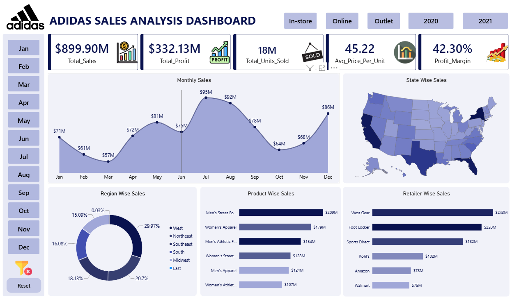

# 📊 Adidas Sales Analysis Dashboard (Power BI)

> An interactive Power BI dashboard that analyzes Adidas US sales performance, helping stakeholders monitor revenue, profitability, product performance, regional sales, and retailer contributions through dynamic visualizations and KPIs.

---

## 🚀 Project Overview

The **Adidas Sales Analysis Dashboard** is a Business Intelligence project developed in **Microsoft Power BI** using the Adidas US Sales dataset.

The dashboard transforms raw sales data into meaningful business insights, enabling decision-makers to track performance, identify trends, compare sales across regions, and evaluate product and retailer performance.

This project demonstrates practical skills in:

- Data Cleaning
- Data Modeling
- Data Visualization
- Business Intelligence
- KPI Development
- Interactive Dashboard Design
- Business Storytelling

---

# 🖼 Dashboard Preview

> *(If the image doesn't appear, verify the file path is correct.)*



---

# 🎯 Business Problem

Retail businesses generate massive amounts of sales data every day. Without effective visualization, identifying sales trends, profitable products, regional performance, and retailer contributions becomes difficult.

This dashboard addresses these challenges by providing an interactive reporting solution that enables users to:

- Monitor overall sales performance
- Analyze profitability
- Compare sales across states and regions
- Identify top-performing retailers
- Evaluate product performance
- Track monthly sales trends
- Filter data dynamically by Month, Sales Method, and Year

---

# 📈 Dashboard Features

### Executive KPIs

- 💰 Total Sales
- 💵 Total Profit
- 📦 Total Units Sold
- 🛒 Average Price per Unit
- 📊 Profit Margin

---

### Interactive Filters

- Month
- Sales Method
  - In-store
  - Online
  - Outlet
- Year
  - 2020
  - 2021

---

### Visualizations

- 📈 Monthly Sales Trend
- 🗺 State-wise Sales Analysis
- 🌎 Region-wise Sales Distribution
- 👕 Product-wise Sales
- 🏪 Retailer-wise Sales

---

# 📊 Key Insights

### 💰 Business Performance

- Total Sales reached **$899.90 Million**
- Total Profit reached **$332.13 Million**
- Total Units Sold exceeded **18 Million**
- Average Selling Price was **45.22**
- Overall Profit Margin was **42.30%**

---

### 📈 Sales Trend

- Sales peaked during **July**.
- Sales declined during **October** before recovering toward the end of the year.

---

### 🌎 Regional Performance

The dashboard compares sales across multiple US regions, helping identify high-performing and underperforming markets.

---

### 👕 Product Performance

Product-wise analysis highlights the highest revenue-generating product categories, enabling better inventory and marketing decisions.

---

### 🏪 Retailer Analysis

Retailer comparison identifies the strongest sales contributors, supporting strategic partnership decisions.

---

# 🛠 Tools & Technologies

| Tool | Purpose |
|------|---------|
| Microsoft Power BI | Dashboard Development |
| Microsoft Excel | Dataset |
| Power Query | Data Cleaning & Transformation |
| DAX | Measures & KPIs |
| GitHub | Version Control & Project Showcase |

---

# 📂 Project Structure

```text
adidas-sales-analysis-powerbi/
│
├── Dashboard/
│   └── Dashboard.png
│
├── Dataset/
│   └── Adidas US Sales_Datasets.xlsx
│
├── Documentation/
│   └── Problem Statement.pptx
│
├── Power BI File/
│   └── Adidas Dashboard Project.pbix
│
└── README.md
```

---

# 💡 Skills Demonstrated

- Data Analysis
- Business Intelligence
- Dashboard Design
- Data Visualization
- Power BI
- Power Query
- DAX
- KPI Development
- Data Storytelling
- Excel
- GitHub

---

# 📌 Future Enhancements

- Add customer segmentation analysis
- Forecast future sales using predictive analytics
- Create mobile-friendly dashboard layout
- Integrate SQL as the data source
- Publish the dashboard to the Power BI Service

---

# 📄 Documentation

Additional project documentation is available in the **Documentation** folder.

---

# 👨‍💻 About Me

**Debabrata Behera**

Aspiring **Data Analyst** passionate about transforming raw data into actionable business insights using **Power BI, SQL, Excel, and Python**.

### Connect with me

- **LinkedIn:** https://www.linkedin.com/in/your-linkedin
- **GitHub:** https://github.com/your-github
- **Email:** your-email@example.com

---

# ⭐ If you found this project helpful, please consider giving it a Star!
